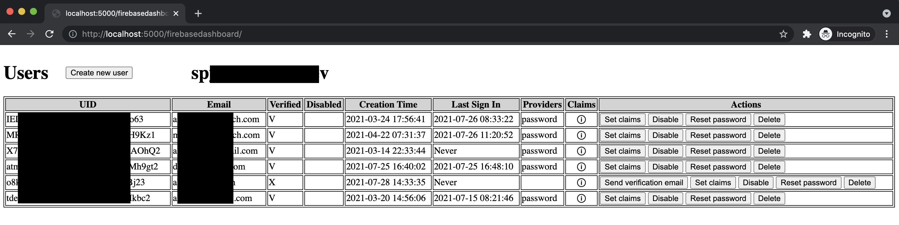

[](https://codecov.io/gh/Asaf-S/firebase-express-dashboard)
# firebase-express-dashboard

Add CRUD routes that manage Firebase Auth to Express.js.

Also, it exposes a dashboard to manage it all.

See ['src/demo.ts'](https://github.com/Asaf-S/firebase-express-dashboard/blob/main/src/demo.ts) file to see how to better integrate it into your project.



```javascript
import express from 'express';
import FB_admin from 'firebase-admin';
import firebaseDashboard from 'firebase-express-dashboard';

const serviceAccount = {
  type: 'service_account',
  project_id: process.env.PROJECT_ID,
  private_key_id: process.env.PRIVATE_KEY_ID,
  private_key: process.env.PRIVATE_KEY,
  client_email: process.env.CLIENT_EMAIL,
  client_id: process.env.CLIENT_ID,
  auth_uri: 'https://accounts.google.com/o/oauth2/auth',
  token_uri: 'https://oauth2.googleapis.com/token',
  auth_provider_x509_cert_url: 'https://www.googleapis.com/oauth2/v1/certs',
  client_x509_cert_url: process.env.CLIENT_X509_CERT_URL,
};

const firebaseInstance = FB_admin.initializeApp({
  credential: FB_admin.credential.cert(serviceAccount),
  databaseURL: process.env.DATABASEURL,
});

express()
  .use('/firebaseDashboard', firebaseDashboard(firebaseInstance))
  .listen(PORT, () => console.log(`Express - Listening on ${PORT}`));
```

Then navigate to either of the following to see the dashboard's UI:

- http://localhost:5000/firebaseDashboard (if the port for development is 5000)
- [https://your_domain.com/firebaseDashboard](https://your_domain.com/firebaseDashboard)

The dashboard's UI can be also be embedded in other websites using an iframe.

# Add permissions:

If the request for the HTML contains a bearer token, then that HTML will use the same bearer token while sending its requests.
This means that the following code should be enough to protect the APIs from unauthorized access:

```javascript
express()
  .use(
    '/firebaseDashboard',
    (req, res, next) => {
      if (req.headers.authorization) {
        const user = authService.convertTokenToUser(req.headers.authorization.replace('bearer ', ''));
        if (user && user.isAdmin) {
          return next();
        }
      }
      return res.sendStatus(401);
    },
    firebaseDashboard(firebaseInstance)
  )
  .listen(PORT, () => console.log(`Express - Listening on ${PORT}`));
```

# Need help with the development of:

- Better UI (React.js cannot be placed in a sub-folder without knowing the sub-folder's name during the build time, if someone can solve this somehow it can help the UI a lot).
- Better UI to list/edit the custom claims.
- Add roles or something of that sort.
- Support paging.
- Support other authentication methods other than Bearer-token.
